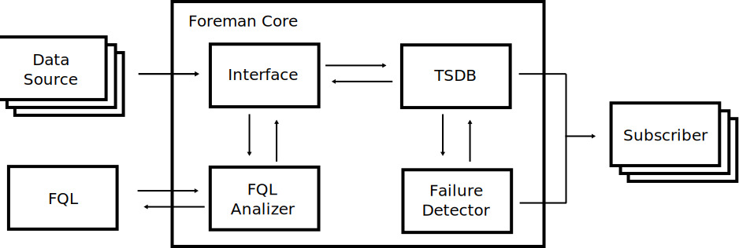
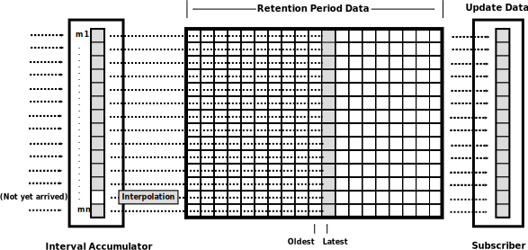
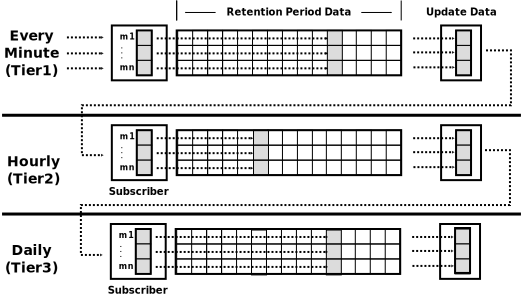

# OVERVIEW

## What is Foreman ?

Foreman is an open-source framework for monitoring, analysis and alerting for cloud computing.

## Features

Foreman's main features are:

- a federated time series database system
- an automated QoS and failure detector

## Purpose

### Distributed monitoring

Gorilla was designed to focus on writing performance and memory e ciency in order to manage the single cluster centrally.
Borgmon is an internal monitoring tool based on an in-memory time series database at Google. Borgmon is a distributed monitoring system; users typically build a single Borgmon unit per cluster.

### Root Cause Analysis

Failure prediction and root cause analysis are an effective approach to enhancing availability. The root cause analysis of the failure is an important operation to prevent the same failure from happening again.

Recent studies such as DataGarage and Gorilla use the stored monitoring metrics in the time series databases for root cause analysis of the failure.

## Architecture

This diagram illustrates the core architecture of Foreman, and the core components are written in C.

### Federated database

A federated database system is a type of database system, which consists of multiple autonomous database systems into a single federated database. Foreman is the primitive database; the operator can define a federated database system which consists of multiple Foremans.

The interface of the time series database is abstracted for the federated database. Through the interface abstraction, the consumer and the provider can access the federated database system with a uniform method.

#### RingMap

Foreman offers some standard implementations of the abstract interface such as Gorilla which is an internal monitoring tool based on an in-memory time series database on Facebook and Graphite which is developed to improve the performance and overcome the limitations of earlier time series databases such as MRTG and RRDtool.

In addition the standard implementations for the time series database, Foreman offer the optimized implementation for root cause analysis called as RingMap as the following.

### Message Passing

A Foreman instance is an object that can send and receive messages with other Foreman instances like the actor model. Foreman supports a publish/subscribe model to chain multiple RingMap instances hierarchically and dynamically. Each Foreman instance has a unique identier consisting of host and name, and a Foreman instance can subscribe to other RingMap instances. The following figure shows each Foreman instance sends a message to other Foreman instances.

Using the message passing functionality, the consumer and provider can create tiered time series databases with any aggregations and different intervals more hierarchically and effectively. For example, The following figure shows three RingMap instances with di erent intervals, every minute, hourly, and daily. The RingMap instances are updated from a metrics data source hierarchically.

